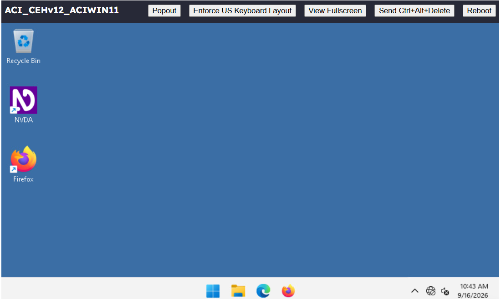
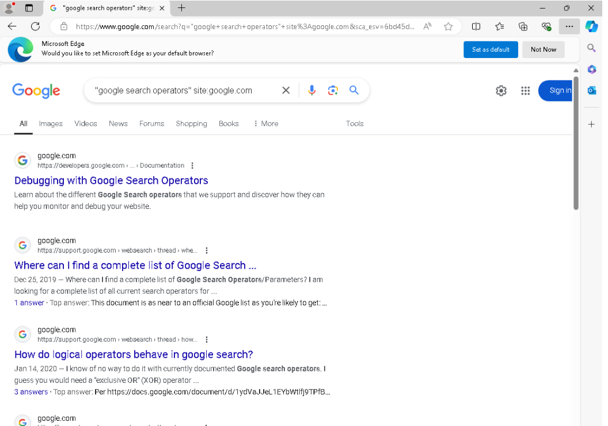
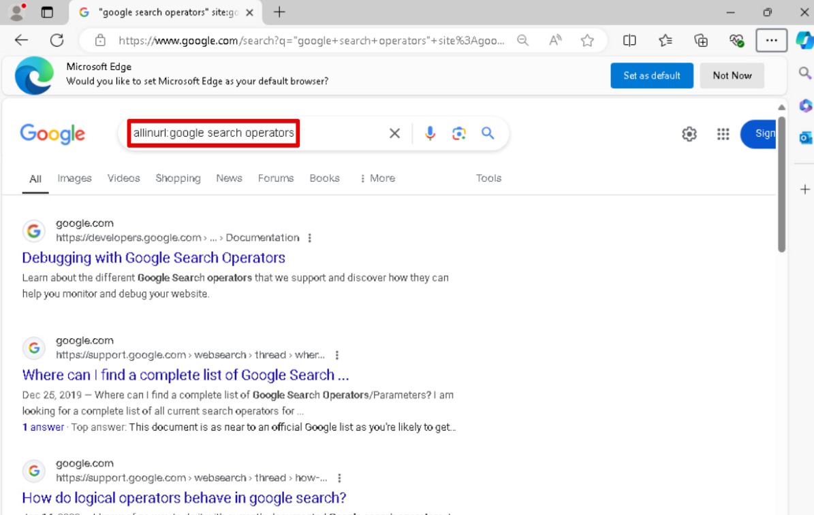
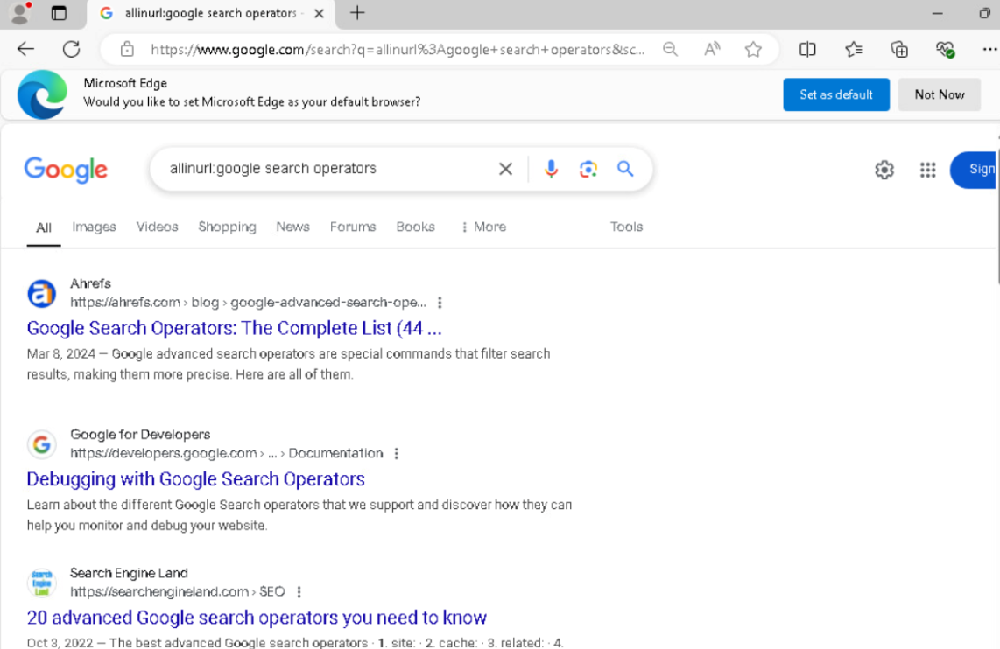

# Footprinting and Reconnaissance Techniques

Hands-on cybersecurity lab documenting reconnaissance techniques using search engines, web services, social networks, website analysis, and DNS tools.

**Course:** Ethical Hacking & Network Defense  
**Status:** In progress

## Overview

In this lab, I am exploring how publicly available information can be used to learn about an organization and its online presence. My goal is to understand what these techniques reveal and how that information can help defenders recognize potential security risks.

This repository will document my work with screenshots, short explanations, and lessons learned. Activities are limited to the targets and tasks authorized for this course lab.

## Learning Goals

- Use Google advanced search operators to find relevant information.
- Gather information through web services, including OpenCorporates.
- Explore publicly available information on social networking sites.
- Review website source code and archived webpages using archive.org.
- Gather and interpret DNS information using `nslookup` and `Dnsenum`.

## Lab Exercises

| Exercise | Topic | Status |
| --- | --- | --- |
| 1 | [Footprinting Using Search Engines](#exercise-1--footprinting-using-search-engines) | In progress |
| 2 | [Footprinting Using Web Services](#exercise-2--footprinting-using-web-services) | Pending |
| 3 | [Footprinting through Social Networking Sites](#exercise-3--footprinting-through-social-networking-sites) | Pending |
| 4 | [Website Footprinting](#exercise-4--website-footprinting) | Pending |
| 5 | [DNS Footprinting](#exercise-5--dns-footprinting) | Pending |

Each exercise will include screenshots and a brief explanation of what I did, what I observed, and what I learned.

## Exercise 1 – Footprinting Using Search Engines

**Focus:** Using Google advanced search operators to narrow searches and locate publicly available information.

Search engines can reveal office locations, contact details, email addresses, and employee names. This exercise explores how that public information can support reconnaissance and why it can create social engineering risks.

### Lab Environment

| Device | Operating System | Role |
| --- | --- | --- |
| ACIDC01 | Windows Server 2022 | Domain controller |
| ACIWIN11 | Windows 11 Pro | Domain member workstation |

### Task 1 – Footprint Using Google Advanced Search Operators

#### Lab Setup

I connected to the ACIWIN11 virtual workstation to begin the exercise. The screenshot shows the Windows 11 desktop, ready for the browser-based search tasks.



#### Open the Browser

I opened Microsoft Edge on the lab workstation to begin the Google searches.

<details>
<summary>Screenshot: Microsoft Edge ready for the search tasks</summary>


</details>

#### Restrict Results to a Domain with `site:`

```text
"google search operators" site:google.com
```

I searched for the phrase "google search operators" and used `site:google.com` to limit results to Google's domain. The visible results included developers.google.com and support.google.com, showing that the filter also includes subdomains. I learned how to focus a search on a specific organization’s public web presence.



#### Search for Words in URLs with `allinurl:`

```text
allinurl:google search operators
```

I used `allinurl:` to search for the words google, search, and operators in webpage URLs. The results shown included Ahrefs, Google for Developers, and Search Engine Land. This introduced me to filtering by URL terms; the operator does not require an exact phrase or a specific word order.

<details>
<summary>Screenshot: entering the allinurl query before submitting it</summary>



</details>



**Observation:** The results page shortens several URLs, so this screenshot alone does not confirm every term in each full URL.

**Skills practiced:** Targeted searching, domain filtering, URL-based searching, and interpreting search results.

**Defense connection:** These techniques help identify publicly searchable information about an organization that could be used to make social engineering attempts more convincing.

**References:** [Google's site operator documentation](https://developers.google.com/search/docs/monitor-debug/search-operators/all-search-site) and [Google's legacy Search Appliance operator reference](https://www.google.com/support/enterprise/static/gsa/docs/admin/current/gsa_doc_set/xml_reference/request_format.html) (allinurl syntax).

*Exercise 1 remains in progress. Additional search steps will be documented as I complete them.*

## Exercise 2 – Footprinting Using Web Services

**Focus:** Using web services, including OpenCorporates, to research publicly available organizational information.

*Screenshots and findings will be added as I complete this exercise.*

## Exercise 3 – Footprinting through Social Networking Sites

**Focus:** Exploring how information shared on social networking sites can contribute to reconnaissance.

*Screenshots and findings will be added as I complete this exercise.*

## Exercise 4 – Website Footprinting

**Focus:** Reviewing website source code and archived webpages using archive.org to understand a website's public information and history.

*Screenshots and findings will be added as I complete this exercise.*

## Exercise 5 – DNS Footprinting

**Focus:** Using `nslookup` and `Dnsenum` to gather and interpret DNS information about authorized lab targets.

*Screenshots and findings will be added as I complete this exercise.*

## Key Takeaways

*After completing the lab, I will summarize the skills I practiced, the information these techniques revealed, and how these lessons connect to network defense.*
