# Footprinting and Reconnaissance Techniques

Hands-on cybersecurity lab documenting reconnaissance techniques using search engines, web services, social networks, website analysis, and DNS tools.

**Course:** Ethical Hacking & Network Defense  
**Status:** In progress

## Overview

In this lab, I am exploring how publicly available information can be used to learn about an organization and its online presence. My goal is to understand what these techniques reveal and how that information can help defenders recognize potential security risks.

This repository will document my work with screenshots, short explanations, and lessons learned. Activities are limited to the targets and tasks authorized for this course lab.

## Learning Goals

- Use Google advanced search operators to find relevant information.
- Gather information through web services, including OpenCorporates.
- Explore publicly available information on social networking sites.
- Review website source code and archived webpages using archive.org.
- Gather and interpret DNS information using `nslookup` and `Dnsenum`.

## Lab Exercises

| Exercise | Topic | Status |
| --- | --- | --- |
| 1 | [Footprinting Using Search Engines](#exercise-1--footprinting-using-search-engines) | Complete |
| 2 | [Footprinting Using Web Services](#exercise-2--footprinting-using-web-services) | Complete |
| 3 | [Footprinting through Social Networking Sites](#exercise-3--footprinting-through-social-networking-sites) | Pending |
| 4 | [Website Footprinting](#exercise-4--website-footprinting) | Complete |
| 5 | [DNS Footprinting](#exercise-5--dns-footprinting) | Pending |

Each exercise will include screenshots and a brief explanation of what I did, what I observed, and what I learned.

## Exercise 1 – Footprinting Using Search Engines

**Focus:** Using Google advanced search operators to narrow searches and locate publicly available information.

Search engines can reveal office locations, contact details, email addresses, and employee names. This exercise explores how that public information can support reconnaissance and why it can create social engineering risks.

### Lab Environment

| Device | Operating System | Role |
| --- | --- | --- |
| ACIDC01 | Windows Server 2022 | Domain controller |
| ACIWIN11 | Windows 11 Pro | Domain member workstation |

### Task 1 – Footprint Using Google Advanced Search Operators

#### Lab Setup

I connected to the ACIWIN11 virtual workstation to begin the exercise. The screenshot shows the Windows 11 desktop, ready for the browser-based search tasks.


#### Open the Browser

I opened Microsoft Edge on the lab workstation to begin the Google searches.

<details>
<summary>Screenshot: Microsoft Edge ready for the search tasks</summary>


</details>

#### Restrict Results to a Domain with `site:`

```text
"google search operators" site:google.com
```

I searched for the phrase "google search operators" and used `site:google.com` to limit results to Google's domain. The visible results included developers.google.com and support.google.com, showing that the filter also includes subdomains. I learned how to focus a search on a specific organization’s public web presence.


#### Search for Words in URLs with `allinurl:`

```text
allinurl:google search operators
```

I used `allinurl:` to search for the words google, search, and operators in webpage URLs. The results shown included Ahrefs, Google for Developers, and Search Engine Land. This introduced me to filtering by URL terms; the operator does not require an exact phrase or a specific word order.

<details>
<summary>Screenshot: entering the allinurl query before submitting it</summary>


</details>


**Observation:** The results page shortens several URLs, so this screenshot alone does not confirm every term in each full URL.

#### Search for a URL Term with `inurl:`

```text
inurl:google search operators
```

I used `inurl:google` to search for URLs containing google, with search and operators as additional search terms. Unlike `allinurl:`, only the word immediately after `inurl:` is restricted to the URL. I scrolled through the results and found pages about Google search operators from several websites.

<details>
<summary>Screenshot: entering the inurl query before submitting it</summary>

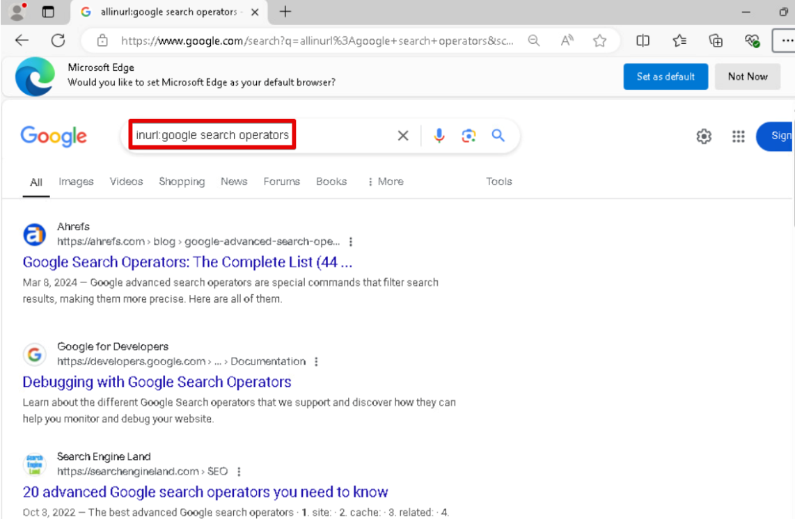

</details>

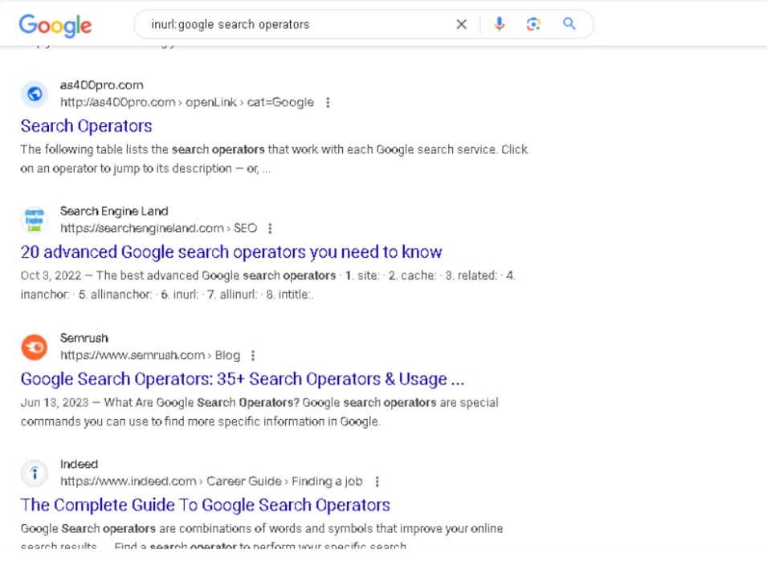

#### Find PDF Documents with `filetype:`

```text
Cybersecurity filetype:pdf
```

I filtered my cybersecurity search to PDF documents. The visible results included the NIST Cybersecurity Framework 2.0 and guidance from other government agencies. I learned how to locate public reports by file format; this query does not require the word cybersecurity to appear in the title.

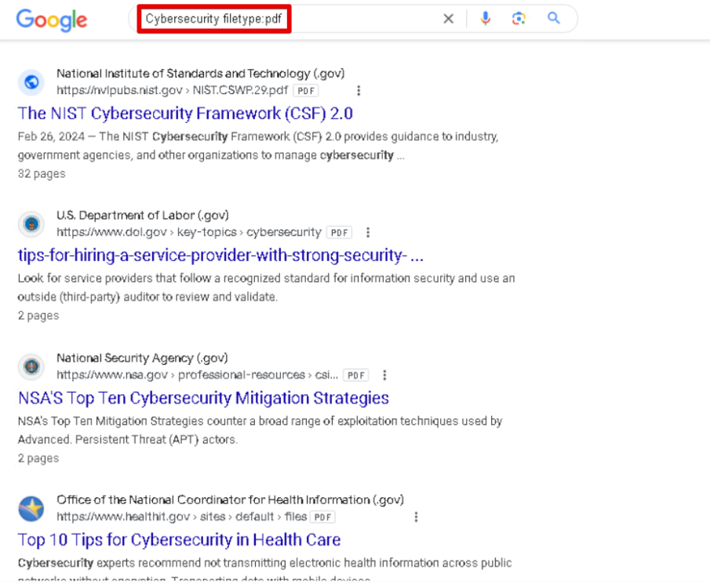

#### Look Up a Term with `define:`

```text
define:cybersecurity
```

I searched for a definition of cybersecurity using `define:`. The results included CISA's "What is Cybersecurity?" page and a computer security information panel. This helped me connect the term to protecting networks, devices, and data.

<details>
<summary>Screenshot: entering the definition query before submitting it</summary>

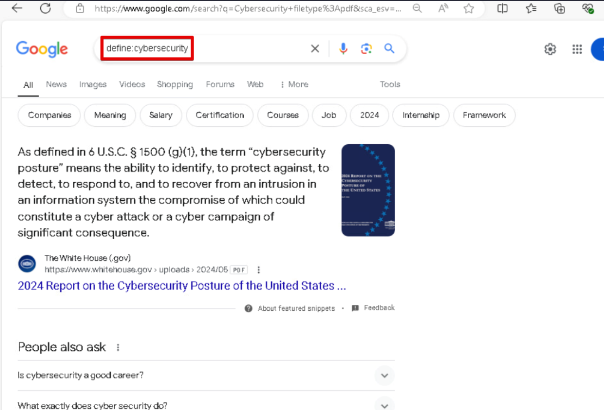

</details>

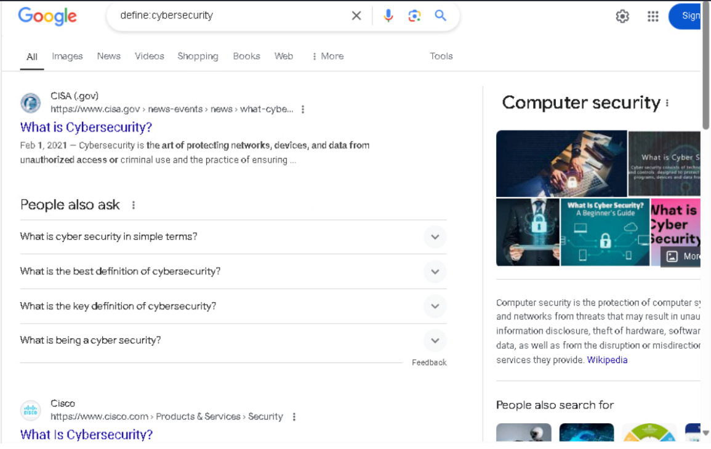

**Skills practiced:** Targeted searching, domain and URL filtering, finding PDF documents, researching terminology, and interpreting search results.

**Defense connection:** These techniques help identify publicly searchable information about an organization that could be used to make social engineering attempts more convincing.

**References:** [Google's site operator documentation](https://developers.google.com/search/docs/monitor-debug/search-operators/all-search-site) and [Google's legacy Search Appliance operator reference](https://www.google.com/support/enterprise/static/gsa/docs/admin/current/gsa_doc_set/xml_reference/request_format.html) (inurl and allinurl syntax), plus [Google's file type documentation](https://developers.google.com/search/docs/crawling-indexing/indexable-file-types).

**Exercise 1 complete.** I practiced narrowing searches by domain, URL terms, and file type, and used a definition query to research terminology.

## Exercise 2 – Footprinting Using Web Services

**Status:** Complete  
**Focus:** Using Google as a web service to identify publicly indexed subdomains.

### Task 1 – Use Web Services for Footprinting

I continued in Microsoft Edge on ACIWIN11, using the same lab environment as Exercise 1: the Windows 11 Pro workstation and ACIDC01 Windows Server 2022 domain controller.

```text
site:google.com -inurl:www
```

I combined `site:google.com` with `-inurl:www` to search Google's domain while excluding URLs containing the term www. The visible results included assistant.google.com, cloud.google.com, and play.google.com. I learned how combining search operators can reveal different parts of an organization's public web presence.

<details>
<summary>Setup screenshots: browser starting point and query entry</summary>

The browser initially showed the definition search from Exercise 1.

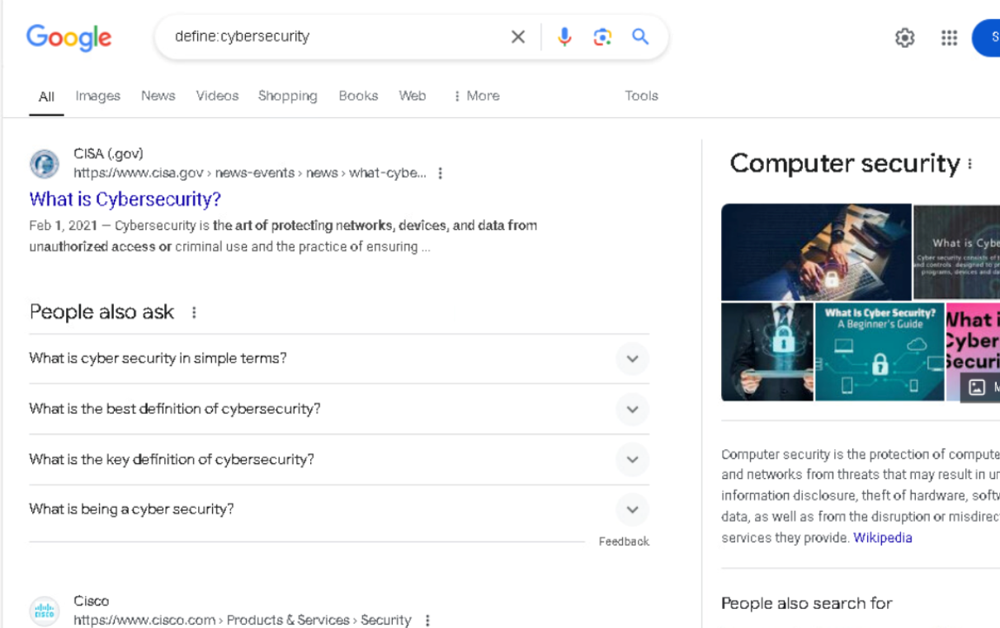

I entered the new query before submitting it; the previous definition results were still visible underneath.

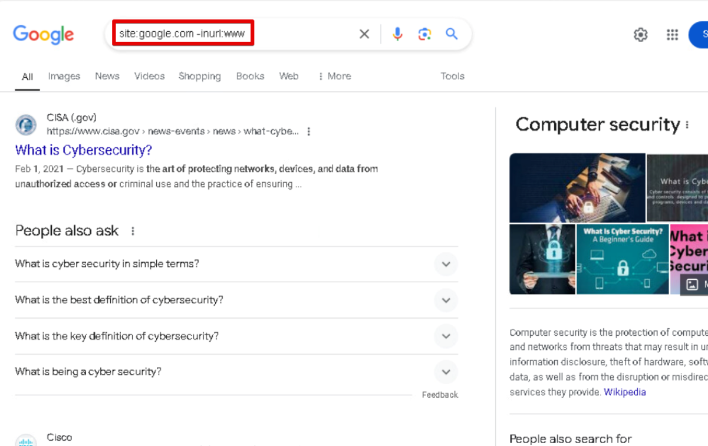

</details>

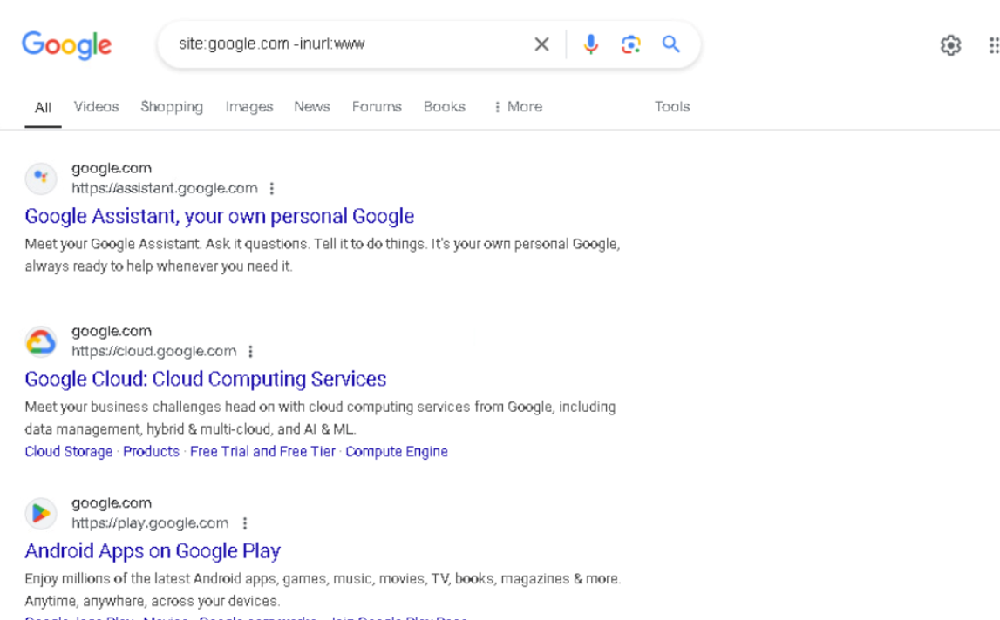

**What I observed:**

| Subdomain visible in the results | Service shown |
| --- | --- |
| `assistant.google.com` | Google Assistant |
| `cloud.google.com` | Google Cloud |
| `play.google.com` | Google Play |

**Limitation:** This search identifies some publicly indexed subdomains, not every subdomain. The exclusion applies to the term www in URLs, rather than only to a www hostname.

**Skills practiced:** Combining search operators, excluding URL terms, identifying subdomains, and documenting public search results.

**Defense connection:** Reviewing publicly visible subdomains can help defenders identify online services to include in an organization's asset inventory.

**Reference:** [Google's site operator documentation](https://developers.google.com/search/docs/monitor-debug/search-operators/all-search-site) explains that site searches are not exhaustive.

## Exercise 3 – Footprinting through Social Networking Sites

**Focus:** Exploring how information shared on social networking sites can contribute to reconnaissance.

*Screenshots and findings will be added as I complete this exercise.*

## Exercise 4 – Website Footprinting

**Status:** Complete  
**Focus:** Reviewing webpage source and archived webpages to understand a website's public information and history.

### Lab Environment

| Device | Operating System | Role |
| --- | --- | --- |
| ACIDC01 | Windows Server 2022 | Domain controller |
| ACIWIN11 | Windows 11 Pro | Domain member workstation |
| ACIKALI | Kali Purple 2023.1 | Stand-alone Linux workstation used for this task |

### Task 1 – Footprint Using Source Code

**Status:** Complete

#### Open the Lab Website

I used Firefox on ACIKALI to open the lab website. It displayed the Infosec Learning login page.

```text
https://lab.infoseclearning.com
```

<details>
<summary>Screenshot: entering the lab website address</summary>

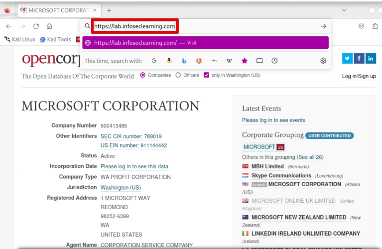

</details>

#### View Page Source

I right-clicked the login page and selected **View Page Source**. This let me inspect the HTML delivered to the browser and identify references to the site's resources.

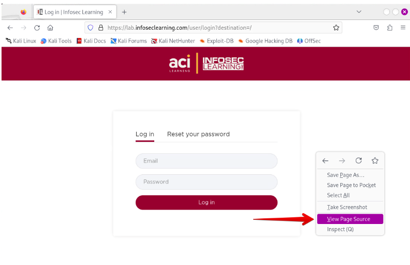

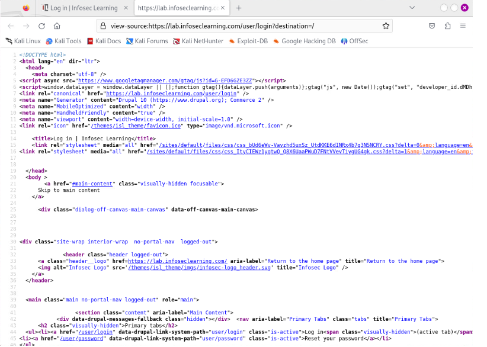

#### Identify JavaScript References

I scrolled to line 95 in the captured source and found a `<script src="...">` reference to a JavaScript file. The source also showed resource paths and generator metadata. I learned how visible HTML can provide clues about a website's technologies and file organization.

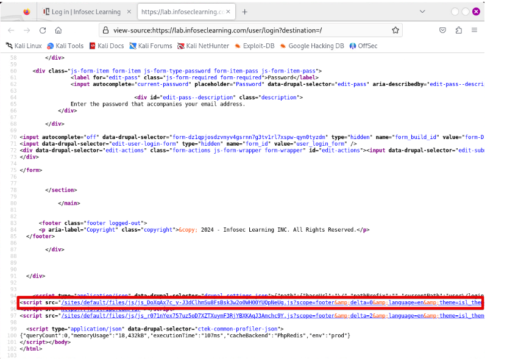

**What I observed:**

| Visible source detail | What it indicates |
| --- | --- |
| `<script src="...">` references to `.js` files | The page loads JavaScript resources. |
| `/sites/default/files/js/` and `/sites/default/files/css/` | Public URL paths used for JavaScript and stylesheets. |
| `/themes/isl_theme/` | A theme resource path referenced by the page. |
| Generator metadata naming `Drupal 10` and `Commerce 2` | The page advertises these technologies; this is a source-level clue, not independent version verification. |

**Skills practiced:** Inspecting HTML source, recognizing script and stylesheet references, identifying technology clues, and documenting visible resource paths.

**Defense connection:** Reviewing public source helps defenders understand what technical information a website exposes. These observations do not establish a vulnerability, reveal server-side source code, or provide a complete server directory listing.

### Task 2 – Footprint Using Archive.org

**Status:** Complete

I opened the Wayback Machine in Microsoft Edge on ACIWIN11 and searched for `practice-labs.com`. I followed the lab's steps to review an archived version and compare it with the live website. This helped me understand how older website content can remain publicly available after a site changes.

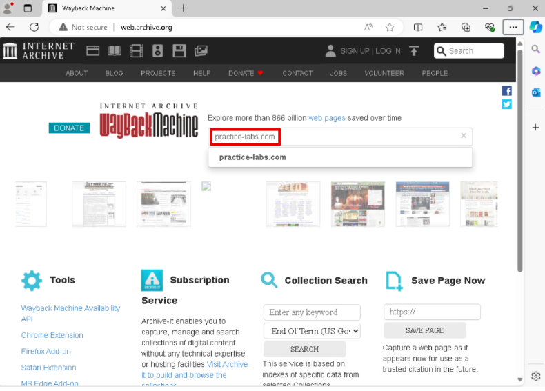

**Lab comparison steps:** Select 2019 in the capture timeline, choose February 27, and open the 19:16:12 snapshot specified in the lab. Then visit `https://practice-labs.com` to compare the archived page with the live site. The lab guide describes a redirect to `www.acilearning.com/itpro`; this is the guide's example, not a verified present-day redirect.

**Screenshot coverage:** The uploaded screenshot documents the domain search entry. The calendar, timestamp selection, archived page, and live-page comparison were illustrated by the lab guide's reference images.

**What I learned:** Calendar circles indicate archived captures, not proof that the website changed on each date. The archive does not preserve every update or guarantee a complete copy of every page. [Internet Archive's Wayback Machine guide](https://help.archive.org/help/using-the-wayback-machine/)

**Skills practiced:** Searching web archives, selecting dated captures, and comparing historical and live web content.

**Defense connection:** Older pages may preserve branding, contact details, or other information that could support impersonation attempts. Reviewing a site's history can help defenders understand what remains publicly accessible.

**Exercise 4 complete:** I practiced inspecting webpage source and using web archives for historical research.

## Exercise 5 – DNS Footprinting

**Focus:** Using `nslookup` and `Dnsenum` to gather and interpret DNS information about authorized lab targets.

*Screenshots and findings will be added as I complete this exercise.*

## Key Takeaways

*After completing the lab, I will summarize the skills I practiced, the information these techniques revealed, and how these lessons connect to network defense.*
